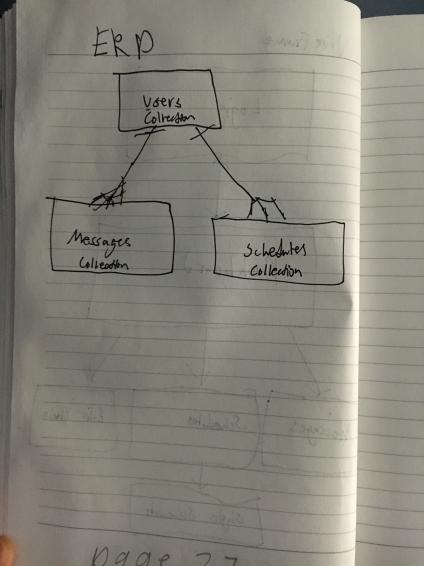
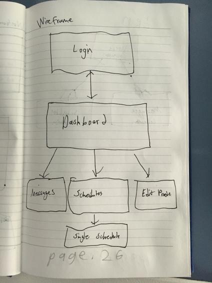

# Problem Statement

Managerial positions spend a substantial amount of effort scheduling employee work shifts, which (according to multiple anecdotes) can take anywhere from a few hours to a whole day.

The goal of this project is to make an schedule generator that prioritizes efficiency, logical accuracy, and dynanism, in order to expedite that process.

# ERD

# WIREFRAME

# Heroku Deployment

# Project Board

